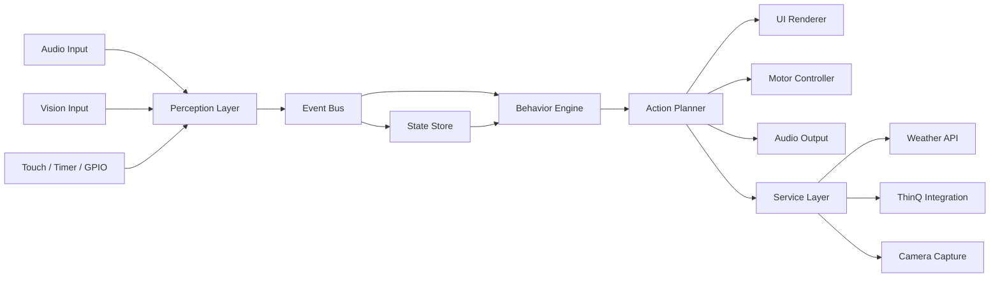

# emo-homehub-rpi

Raspberry Pi 위에서 `smart home hub + emo pet`을 함께 동작시키기 위한 프로젝트 초안입니다.
이 단계에서는 아직 구현 코드를 넣지 않고, 아키텍처와 디렉토리 구조를 먼저 정리합니다.

## 프로젝트 목표

- 음성, 비전, 터치, 타이머 기반 입력을 하나의 인터랙션 시스템으로 통합
- 감정 표현과 물리 반응을 가지는 `emo pet` 동작 구현
- 스마트 홈 제어(ThinQ, 날씨, 타이머 등)를 같은 인터페이스 안에 묶기
- Raspberry Pi 자원 제약 안에서 안정적으로 돌아가는 구조 설계

## 핵심 설계 원칙

1. 이벤트 기반(Event-Driven)
   센서와 기능을 직접 서로 호출하지 않고, 모두 이벤트를 발행하고 소비하게 만듭니다.

2. 상태 중심(State-Centered)
   단순 명령 실행보다 `현재 무엇을 보고 있는지`, `사용자가 방금 다시 나타났는지`, `유휴 시간이 얼마나 됐는지` 같은 상태를 중심에 둡니다.

3. 하드웨어 추상화(Hardware Abstraction)
   카메라, 모터, 터치센서, 스피커, 디스플레이를 바로 비즈니스 로직에서 쓰지 않고 어댑터 계층으로 감쌉니다.

4. 로컬 우선(Local-First), 네트워크 선택(Network-Optional)
   얼굴 추적, 제스처, 기본 음성 명령은 최대한 로컬에서 돌리고, 날씨나 ThinQ 같은 외부 연동만 네트워크에 의존하게 합니다.

5. 큰 상태 머신 하나 대신 작은 상태 머신 여러 개
   `존재 감지`, `행동 모드`, `UI 모드`, `슬립/유휴`를 분리해야 나중에 기능이 늘어나도 관리가 쉽습니다.

## 권장 상위 구조

## 문서 안내

- [아키텍처 상세](./docs/architecture.md)
- [상태 머신 설계](./docs/state-machine.md)
- [추천 디렉토리 구조](./docs/project-layout.md)

## 가장 추천하는 런타임 전략

초기 버전은 아래처럼 시작하는 것이 좋습니다.

- 메인 프로세스 1개: 오케스트레이션, 상태 저장소, 타이머, 행동 엔진
- 워커 프로세스 2개:
  - `audio worker`: VAD/STT/명령 추출
  - `vision worker`: 얼굴, 손동작, 재등장 패턴 감지
- I/O 어댑터:
  - 디스플레이, 스피커, 카메라 캡처, 모터, GPIO 센서

이 구성이 좋은 이유:

- Raspberry Pi에서 무거운 비전/STT 처리를 메인 루프와 분리 가능
- 한 워커가 잠시 느려져도 전체 감정/UI 로직이 멈추지 않음
- 추후 ZeroMQ, MQTT, Redis 없이도 내부 큐 기반으로 시작 가능

## 먼저 구현할 때의 우선순위

1. 공통 이벤트 포맷과 이벤트 버스
2. 상태 저장소와 상태 머신 분리
3. Face presence / voice command / touch 입력의 최소 루프
4. UI 반응과 모터 반응의 액션 플래너
5. 타이머, 날씨, 사진, ThinQ 같은 기능성 서비스

## 지금 만들어 둔 폴더

- `docs/`: 아키텍처 및 설계 문서
- `src/`: 나중에 실제 구현이 들어갈 자리
- `configs/`: 트리거, 임계치, 디바이스 설정
- `assets/`: 표정, 사운드, 애니메이션, UI 리소스
- `tests/`: 테스트 코드

