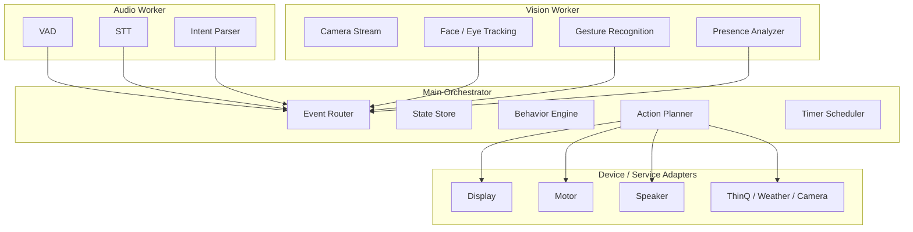

# Architecture

## 1. 시스템을 어떻게 나누는 게 좋은가

이 프로젝트는 한 덩어리 앱으로 만들기보다, 아래 6개 층으로 나누는 것이 좋습니다.

1. Input Adapter Layer
2. Perception Layer
3. Event Bus Layer
4. State / Context Layer
5. Behavior / Skill Layer
6. Output / Actuation Layer

핵심은 `입력 -> 인식 -> 이벤트 -> 상태 판단 -> 행동 결정 -> 출력` 흐름을 명확히 분리하는 것입니다.

## 2. 레이어별 역할

### 2.1 Input Adapter Layer

실제 하드웨어나 외부 입력을 받아 표준화된 내부 이벤트로 바꾸는 층입니다.

포함 대상:

- 마이크 입력
- 카메라 프레임 입력
- 터치 센서 / GPIO
- 내부 타이머 / 스케줄러
- 네트워크 응답 수신

중요 포인트:

- 이 계층은 `명령 의미`를 해석하지 않습니다.
- 예를 들어 마이크 계층은 `audio.chunk.ready`, `voice.segment.started` 같은 사건만 올리고, `"사진 찍어줘"`가 무슨 뜻인지는 다음 계층에서 판단합니다.

### 2.2 Perception Layer

센서 데이터를 해석해서 의미 있는 이벤트를 만듭니다.

예시 모듈:

- `speech pipeline`
  - VAD
  - STT
  - command parser / intent classifier
- `vision pipeline`
  - face detection
  - face tracking
  - eye landmarks
  - gesture recognition
  - head direction estimation
- `presence logic`
  - 얼굴 미검출 누적 시간
  - 재등장 감지
  - 음성은 들렸지만 얼굴이 없는 상황

이 층의 출력 예시:

- `voice.command.detected`
- `vision.face.detected`
- `vision.face.lost`
- `vision.gesture.v_sign`
- `vision.gesture.gun_pose`
- `touch.stroke.detected`

### 2.3 Event Bus Layer

모든 모듈이 서로 직접 연결되지 않게 만드는 중간 허브입니다.

이 레이어를 두는 이유:

- 기능 간 결합도를 줄임
- 나중에 센서나 API 교체가 쉬움
- 로그를 이벤트 단위로 남기기 좋음
- 규칙 기반 반응을 추가하기 쉬움

추천 방식:

- 초기: Python `asyncio.Queue` 또는 내부 pub/sub
- 확장: ZeroMQ 또는 MQTT

초기 MVP에서는 외부 브로커 없이도 충분합니다.

### 2.4 State / Context Layer

이 프로젝트의 중심입니다.

여기에는 아래 같은 정보가 들어갑니다.

- 현재 얼굴이 보이는가
- 마지막 얼굴 검출 시각
- 마지막 음성 감지 시각
- 현재 추적 대상 좌표
- 현재 UI 모드
- 현재 행동 모드
- 유휴 누적 시간
- 수면/졸음 상태
- 게임 진행 상태
- 활성 타이머 목록
- 스마트홈 디바이스 상태 캐시

이 레이어는 단순 저장소가 아니라 `맥락`을 만드는 곳입니다.

예를 들어:

- `voice.command.detected`가 왔을 때
- `face_present == false`
- 그리고 `last_face_seen > N초 전`

이면 단순 명령 수행이 아니라 먼저 `화들짝 -> face tracking 시작` 같은 반응을 넣을 수 있습니다.

### 2.5 Behavior / Skill Layer

이벤트와 상태를 보고 실제로 무엇을 할지 결정하는 층입니다.

하위 구성 추천:

- `reaction rules`
  - 빠른 반응 규칙
  - 예: 얼굴 없이 음성 -> 놀람
- `behavior engine`
  - 감정/행동 상태 전환
  - 예: idle -> attentive -> playful -> sleepy
- `skill handlers`
  - 날씨
  - 타이머
  - 사진 촬영
  - 게임 모드
  - ThinQ 제어
- `action planner`
  - 표정, 사운드, 목 모터, UI 변화를 하나의 액션 시퀀스로 합성

중요한 점:

- `행동 결정`과 `출력 실행`은 분리해야 합니다.
- 예를 들어 "댄스 모드"는 행동 엔진이 결정하고, 실제 사운드 재생/모터/UI는 액션 플래너와 출력 계층이 담당합니다.

### 2.6 Output / Actuation Layer

결정된 액션을 실제 하드웨어나 화면에 반영합니다.

예시:

- 디스플레이 얼굴 렌더링
- 표정 전환
- 게임 UI 버튼 생성
- 모터 제어
- 셔터 동작
- TTS / 효과음 재생
- 스마트홈 API 호출

이 레이어는 가능하면 `idempotent`하고 짧은 명령 단위로 두는 것이 좋습니다.

예:

- `set_expression("surprised")`
- `move_neck_to(x, y)`
- `play_animation("dreaming")`
- `capture_photo()`
- `thinq.turn_on("aircon")`

## 3. 추천 프로세스 구조

Raspberry Pi에서는 아래처럼 나누는 것이 현실적입니다.



## 4. 가장 중요한 설계 포인트

### 4.1 하나의 거대한 상태 머신은 피하기

`idle + sleepy + tracking + dancing + game + surprised + photo + face_missing`를 한 FSM으로 합치면 금방 폭발합니다.

대신 아래처럼 나누는 게 좋습니다.

- Presence FSM
- Interaction FSM
- Activity FSM
- UI FSM
- Smart-home task FSM

그리고 상위 오케스트레이터가 이 상태들을 함께 보고 최종 행동을 결정합니다.

### 4.2 이벤트는 "의미 + 신뢰도 + 시각"을 가져야 함

추천 이벤트 예시:

```json
{
  "topic": "vision.gesture.detected",
  "timestamp": "2026-04-15T10:23:11.245Z",
  "source": "vision_worker",
  "confidence": 0.91,
  "payload": {
    "gesture": "gun_pose",
    "bbox": [120, 40, 300, 280]
  }
}
```

이렇게 해두면:

- 낮은 신뢰도 이벤트 무시 가능
- 디버깅 쉬움
- 후처리 규칙 추가 쉬움

### 4.3 반응 규칙은 행동과 서비스 명령을 함께 만들 수 있어야 함

예:

- `"날씨 알려줘"` -> TTS 응답 + 얼굴 표정 변화
- `"사진 찍어줘"` -> 카운트다운 UI + 셔터 + 저장 알림
- `"게임 모드로 바꿔줘"` -> 얼굴 UI 축소 + 버튼 생성 + 상태 전환

즉, 한 입력이 항상 하나의 출력만 만들지 않습니다.
그래서 액션 플래너가 필요합니다.

### 4.4 Presence Logic을 별도 모듈로 두기

이 명세에서는 존재 감지가 핵심입니다.

예:

- 얼굴 없음 + 음성 감지 -> 놀람
- n분 동안 얼굴 없음 -> 졸음
- 다시 얼굴 등장 -> 반김
- 재등장 직후 음성 -> 깜짝 반응

이런 규칙은 단순 얼굴 검출 모듈에 넣지 말고, 별도 `presence logic`이 시간 맥락까지 포함해 관리해야 합니다.

## 5. 대표 기능별 이벤트 흐름

### 5.1 "사진 찍어줘"

```text
mic input
-> speech pipeline
-> voice.command.detected(photo_capture)
-> behavior engine
-> action planner
-> UI countdown + shutter sfx + camera capture + saved notification
```

### 5.2 얼굴이 없는데 음성이 들림

```text
voice.segment.detected
-> state says face_present = false
-> reaction rule fires startled motion
-> tracking mode requested
-> vision face search starts
```

### 5.3 오래 방치되다가 다시 얼굴 등장

```text
vision.face.lost
-> absence duration accumulates
-> sleepy state entered
-> dream animation starts
-> vision.face.detected
-> reappearance event emitted
-> greeting / welcome behavior
```

### 5.4 스마트홈 명령

```text
voice.command.detected(thinq.aircon_on)
-> skill handler validates device + network
-> service adapter sends command
-> success/failure event
-> TTS + expression feedback
```

## 6. 추천 모듈 경계

### 음성

- speech capture
- VAD
- STT
- intent parser
- command normalizer

### 비전

- camera input
- face detection
- face tracking
- hand / gesture recognition
- head direction classifier
- photo pose recognizer

### 로직

- presence logic
- timer scheduler
- behavior engine
- game controller
- smart-home controller

### 출력

- face renderer
- UI overlay renderer
- motor controller
- sound / TTS controller
- notification controller

## 7. Raspberry Pi 기준 현실적인 권장사항

- 얼굴 추적과 STT를 동시에 항상 최고 품질로 돌리면 과부하가 날 수 있음
- 카메라 파이프라인과 STT 파이프라인은 별도 프로세스로 분리 권장
- 추론 빈도는 기능별로 다르게 설정
  - face presence: 높음
  - gesture recognition: 중간
  - full STT: 음성 구간에서만
- 네트워크 장애 시에도 로컬 반응은 살아 있어야 함

즉, `외부 API가 죽어도 emo pet 자체는 살아 있는 구조`가 좋습니다.

## 8. 나중에 코드로 옮길 때의 추천 구현 순서

1. 공통 이벤트 모델 정의
2. 상태 저장소와 Presence FSM
3. Audio worker / Vision worker 뼈대
4. Behavior engine + action planner
5. UI / motor / sound 어댑터
6. Timer / weather / photo
7. ThinQ 및 기타 스마트홈 연동

