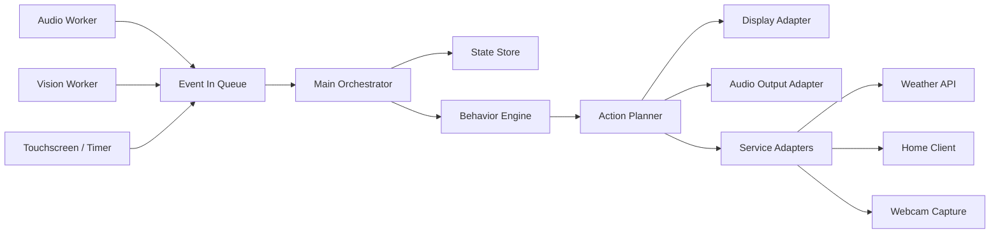

# Architecture

이 문서는 `prd.md`를 실제 구현 관점으로 풀어쓴 문서입니다.
여기서 설명하는 구조는 모두 Raspberry Pi 기준 단일 구현 방향을 전제로 합니다.

## 1. 아키텍처 기준

RIO는 아래 원칙으로 구성합니다.

- `event-driven`
- `state-centered`
- `main orchestrator + worker processes`
- `local UI + local perception + selective network services`

핵심 흐름은 아래와 같습니다.



## 2. 고정된 런타임 모델

### 2.1 프로세스 구성

RIO는 초기 구현에서 아래 3프로세스 구조를 기준으로 합니다.

1. `Main Orchestrator`
2. `Audio Worker`
3. `Vision Worker`

이 구조를 고정하는 이유:

- Raspberry Pi에서 음성/STT와 비전 추론을 메인 로직과 분리할 수 있음
- 한쪽 인식 파이프라인이 잠시 느려져도 상태 관리와 UI 루프를 유지할 수 있음
- 멀티 프레임워크 대신 Python 중심 구조로 유지 가능

### 2.2 프로세스 간 통신

- 프로세스 간: `queue 기반 이벤트 전달`
- 메인 프로세스 내부: `event router + state reducer + action planner`

문서 기준에서는 MQTT, ZeroMQ, 웹소켓 같은 외부 브로커를 기본값으로 두지 않습니다.
초기 구현은 내부 큐 기반으로 충분합니다.

## 3. 계층 구조

### 3.1 Input Adapters

실제 입력을 표준 이벤트로 바꾸는 계층입니다.

- 마이크
- 웹캠
- 터치스크린
- 타이머
- 네트워크 응답

이 계층은 의미를 해석하지 않고 원시 입력 또는 1차 이벤트만 생성합니다.

### 3.2 Perception Layer

입력을 의미 있는 사건으로 해석합니다.

음성:

- VAD
- STT
- intent normalization

비전:

- face detection
- face center tracking
- gesture recognition
- head direction estimation
- reappearance detection

출력 이벤트 예시:

- `voice.intent.detected`
- `vision.face.detected`
- `vision.face.lost`
- `vision.gesture.detected`
- `touch.stroke.detected`
- `timer.expired`

### 3.3 State / Context Layer

RIO의 중심 저장소입니다.

반드시 관리해야 하는 상태:

- 얼굴 존재 여부
- 마지막 얼굴 검출 시각
- 마지막 음성 감지 시각
- reappearance window
- 현재 행동 상태
- 현재 UI 상태
- 활성 타이머
- 진행 중 작업
- 스마트홈 명령 결과 캐시

### 3.4 Behavior Layer

이벤트와 상태를 보고 무엇을 할지 결정합니다.

하위 구성:

- `reaction rules`
- `behavior state reducer`
- `scene selector`
- `task dispatcher`

예:

- 얼굴 없음 + 음성 감지 -> `startled_then_track`
- `camera.capture` -> `take_photo_countdown`
- `smarthome.aircon.on` -> smart-home task dispatch + success/failure feedback

### 3.5 Output / Actuation Layer

행동 결정을 실제 출력으로 옮기는 계층입니다.

- display adapter
- speaker / TTS adapter
- camera adapter
- weather adapter
- home-client adapter

핵심 원칙은 `행동 결정`과 `실행`을 분리하는 것입니다.
이 프로젝트에서 얼굴 방향감과 시선 이동은 `display adapter`가 애니메이션으로 표현하며, 별도 모터 제어는 포함하지 않습니다.

## 4. UI 아키텍처

PRD의 3-layer UI를 구현 기준으로 고정합니다.

### 4.1 Layer 구성

1. `Core Face`
2. `Action Overlay`
3. `System HUD`

### 4.2 구현 규칙

- display adapter는 세 레이어를 독립적으로 업데이트 가능해야 함
- 얼굴 표정과 HUD는 서로 독립 상태를 가질 수 있어야 함
- 눈 방향 변화는 face center를 입력으로 받아 화면 애니메이션으로 처리해야 함
- 게임 모드에서는 얼굴 영역 축소 + 하단 버튼 또는 가상 입력 영역을 띄울 수 있어야 함

즉, 화면은 하나의 정적 캔버스가 아니라 `layer compositor`처럼 설계해야 합니다.

## 5. 스마트홈 아키텍처

RIO는 스마트홈 제어를 직접 분산 구현하지 않고 하나의 adapter를 통해 처리합니다.

### 5.1 요청 흐름

```text
voice -> STT -> intent normalization
-> smart_home domain
-> home_client adapter
-> PUT /device/control
-> success/failure event
-> face + sound + HUD feedback
```

### 5.2 계약

- home-client endpoint: `http://[HOME_CLIENT_IP]/device/control`
- method: `PUT`
- 최소 body: `{ "content": "<user command>" }`

구현 시 구조화 payload를 추가하더라도, 문서 기준 기본 계약은 위 형태를 유지합니다.

## 6. 이벤트 계약

문서 간 구현 차이를 줄이기 위해 모든 핵심 이벤트는 아래 형식을 따릅니다.

```json
{
  "topic": "voice.intent.detected",
  "source": "audio_worker",
  "timestamp": "2026-04-15T10:23:11.245Z",
  "confidence": 0.95,
  "payload": {
    "intent": "camera.capture",
    "text": "사진 찍어줘"
  }
}
```

필수 필드:

- `topic`
- `source`
- `timestamp`
- `payload`

권장 필드:

- `confidence`
- `trace_id`

## 7. 명령어 처리 원칙

문서에서 `"emo dance!"`와 `"RIO dance!"`를 각각 다른 기능으로 취급하지 않습니다.

원칙:

- 문장 단위가 아니라 `intent` 단위로 처리
- alias는 설정 파일에서 관리
- 상위 로직은 항상 정규화된 intent를 기준으로 분기

즉, 문서의 예시 문장은 예시일 뿐이며 구현의 기준 키는 intent입니다.

## 8. 실패 처리 원칙

### 8.1 네트워크 실패

- home-client 호출 실패
- weather API 실패

위 상황에서도:

- 표정 반응
- 실패 사운드
- HUD 메시지

는 반드시 남깁니다.

### 8.2 센서 실패

- 카메라 없음 -> face tracking 비활성, 음성/터치만 유지
- 터치스크린 없음 -> 음성/비전 반응만 유지
- 마이크 없음 -> 비전/터치 기반 반응만 유지

즉, 기능이 일부 빠져도 시스템 전체는 계속 살아 있어야 합니다.

## 9. 우선 구현 모듈

1. `core/events`
2. `core/state`
3. `domains/presence`
4. `domains/speech`
5. `domains/behavior`
6. `adapters/display`
7. `adapters/speaker`
8. `adapters/home_client`
9. `domains/timers`
10. `domains/photo`
