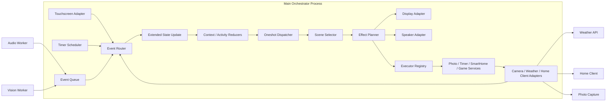

# Architecture

이 문서는 `prd.md`를 실제 구현 관점으로 풀어쓴 문서입니다.
여기서 설명하는 구조는 모두 Raspberry Pi 기준 단일 구현 방향을 전제로 합니다.

## 1. 아키텍처 기준

RIO는 아래 원칙으로 구성합니다.

- `event-driven`
- `state-centered`
- `main orchestrator + worker processes`
- `local UI + local perception + selective network services`

핵심 흐름은 아래와 같습니다.



이 다이어그램의 목적은 "박스 이름을 예쁘게 보여주는 것"보다,
실제 코드에서 어떤 책임 단위로 바로 나눌지 드러내는 것입니다.

초기 구현에서는 아래처럼 읽으면 됩니다.

| 런타임 블록 | 실제 책임 | 대표 경로 |
| :--- | :--- | :--- |
| `Event Router` | 이벤트 수신, 구독/발행, 메인 루프 진입점 | `src/app/core/bus/` |
| `Extended State Update` | `face_present`, `last_face_seen_at`, `deferred_intent` 등 갱신 | `src/app/core/state/extended_state.py` |
| `Context / Activity Reducers` | FSM 전이 계산 | `src/app/core/state/context_fsm.py`, `src/app/core/state/activity_fsm.py` |
| `Oneshot Dispatcher` | `startled`, `welcome`, `happy`, `confused` 발화/중첩 정책 | `src/app/core/state/oneshot.py` |
| `Scene Selector` | `(Context, Activity, oneshot)`에서 `(Mood, UI)` 파생 | `src/app/core/state/scene_selector.py` |
| `Effect Planner` | 파생 결과를 출력 명령과 실행 명령으로 변환 | `src/app/domains/behavior/effect_planner.py` |
| `Executor Registry` | `Executing(kind)`별 도메인 핸들러 선택 | `src/app/domains/behavior/executor_registry.py` |
| `Photo / Timer / SmartHome / Game Services` | 기능별 실행 시퀀스 | `src/app/domains/` |
| `Camera / Weather / Home Client Adapters` | 외부 I/O 호출 | `src/app/adapters/` |

## 2. 고정된 런타임 모델

### 2.1 프로세스 구성

RIO는 아키텍처 목표로 아래 3구성 요소를 기준으로 합니다.

1. `Main Orchestrator`
2. `Audio Worker`
3. `Vision Worker`

다만 현재 저장소의 기본 런타임(`RioOrchestrator`, `scripts/live_interaction_test.py`)은
`AudioWorker`, `VisionWorker`, `TouchWorker`를 동일 프로세스 안에서 polling하는 형태입니다.
이벤트 버스와 워커 경계를 먼저 유지해 두고, 추후 필요할 때 실제 프로세스 분리로 확장할 수 있게 설계되어 있습니다.

이 구조를 고정하는 이유:

- Raspberry Pi에서 음성/STT와 비전 추론을 메인 로직과 분리할 수 있음
- 한쪽 인식 파이프라인이 잠시 느려져도 상태 관리와 UI 루프를 유지할 수 있음
- 멀티 프레임워크 대신 Python 중심 구조로 유지 가능

### 2.2 프로세스 소유권 규칙

각 입출력 구성요소는 아래 기준으로 소속 프로세스가 결정됩니다.

- `Audio Worker`
  - 마이크 캡처
  - VAD
  - STT
  - intent normalization
- `Vision Worker`
  - 카메라 프레임 수신
  - 얼굴 검출 / 중심 추적
  - 제스처 인식
  - 재등장 감지
- `Main Orchestrator` (내부 모듈로 실행)
  - Touchscreen input adapter / `TouchWorker` in-process polling
  - Timer scheduler
  - Service adapters (`home_client`, `weather`, `camera`) 요청 및 응답 처리
  - Display adapter, Speaker adapter
  - State store, reducers, oneshot dispatcher, scene selector
  - Effect planner, executor registry
  - Event router

분리 기준은 아래와 같습니다.

- 별도 워커: `지속 스트림 + 무거운 추론 파이프라인`에 한함 (현재는 오디오/비전 2종)
- 메인 내부 모듈: 이벤트성/경량 I/O, UI 렌더 루프에 밀착된 입력, 요청-응답형 네트워크 어댑터

터치/타이머/HTTP 응답을 별도 프로세스로 분리하지 않는 이유:

- 터치는 display adapter와 동일한 UI 이벤트 루프에서 받는 편이 가장 단순함
- Timer는 `core/scheduler/`가 내부 bus에 `timer.expired`만 넣으면 충분함
- 서비스 어댑터 응답은 요청 주체(메인)에서 async 추적하는 편이 자연스러움

### 2.3 프로세스 간 통신

- 프로세스 간: `queue 기반 이벤트 전달`
- 메인 프로세스 내부: `event router + extended state update + reducers + effect planner`

현재 기본 런타임에서는 이 큐를 동일 프로세스 안에서 drain하며,
`QueueBus` 자체는 multiprocessing queue를 사용해 향후 분리를 염두에 둔 형태를 유지합니다.

문서 기준에서는 MQTT, ZeroMQ, 웹소켓 같은 외부 브로커를 기본값으로 두지 않습니다.
초기 구현은 내부 큐 기반으로 충분합니다.

### 2.4 메인 루프 기준

구현을 시작할 때 메인 프로세스는 아래 순서로 한 이벤트씩 처리하는 구조를 기준으로 합니다.

1. 입력 이벤트 수신
2. extended state 업데이트
3. `Context` / `Activity` reducer 실행
4. 필요한 oneshot 발화
5. `Scene Selector`로 `(Mood, UI)` 파생
6. 출력 명령과 도메인 실행 명령 계획
7. display / speaker / service adapter 및 도메인 executor 호출

즉, RIO의 중심은 "입력을 받아 바로 서비스 호출"하는 구조가 아니라,
**이벤트를 상태와 씬으로 먼저 해석한 뒤 행동을 계획하는 루프**입니다.

## 3. 계층 구조

### 3.1 Input Adapters

실제 입력을 표준 이벤트로 바꾸는 계층입니다.

- 마이크
- 웹캠
- 터치스크린
- 타이머
- 네트워크 응답

이 계층은 의미를 해석하지 않고 원시 입력 또는 1차 이벤트만 생성합니다.

### 3.2 Perception Layer

입력을 의미 있는 사건으로 해석합니다.

음성:

- VAD
- STT
- intent normalization

비전:

- face detection
- face center tracking
- gesture recognition
- head direction estimation
- reappearance detection

출력 이벤트 예시:

- `voice.intent.detected`
- `vision.face.detected`
- `vision.face.lost`
- `vision.gesture.detected`
- `touch.stroke.detected`
- `timer.expired`

### 3.3 State / Context Layer

RIO의 중심 저장소입니다.

상태 저장소는 아래 세 층으로 나눠 관리합니다 ([state-machine.md](state-machine.md) 참고).

1. **Authoritative State**
   - `context_state`: `Away` / `Idle` / `Engaged` / `Sleepy`
   - `activity_state`: `Idle` / `Listening` / `Executing` / `Alerting`
   - `active_oneshot`: 이름, 시작 시각, 종료 시각, priority

2. **Extended State**
   - `face_present`
   - `last_face_seen_at`
   - `last_user_evidence_at`
   - `last_interaction_at`
   - `away_started_at`
   - `active_executing_kind`
   - `deferred_intent`

3. **Runtime Resources**
   - 활성 타이머 레지스트리
   - 실행 중 외부 요청 추적 정보 (`request_id`, `kind`, timeout)
   - 최근 서비스 결과 캐시 (`weather`, `smarthome`)
   - capability / degraded flags (`camera_available`, `mic_available`, `touch_available`)

표정(Mood)과 UI 레이아웃은 별도 상태로 저장하지 않습니다.
`Scene Selector`가 위 상태들로부터 매 전이마다 파생 계산합니다.

권장 저장 구조 예시는 아래와 같습니다.

```python
store = {
    "context_state": "Away",
    "activity_state": "Idle",
    "active_oneshot": None,
    "face_present": False,
    "last_face_seen_at": None,
    "last_user_evidence_at": None,
    "last_interaction_at": None,
    "away_started_at": None,
    "active_executing_kind": None,
    "deferred_intent": None,
    "timers": {},
    "inflight_requests": {},
    "capabilities": {
        "camera_available": True,
        "mic_available": True,
        "touch_available": True,
    },
}
```

### 3.4 Behavior Layer

이벤트와 상태를 보고 무엇을 할지 결정합니다. 상세한 FSM 정의는 [state-machine.md](state-machine.md) 참고.

하위 구성:

- `context reducer` — 사용자/시간 맥락 축 갱신 (Away/Idle/Engaged/Sleepy)
- `activity reducer` — 실행 축 갱신 (Idle/Listening/Executing/Alerting)
- `oneshot dispatcher` — 순간 반응 이벤트 발화/중첩 정책 관리
- `scene selector` — `(Context, Activity, oneshot)` → `(Mood, UI)` 순수 함수
- `effect planner` — 상태 전이와 씬 변경을 display/speaker/service 명령으로 변환
- `executor registry` — `Executing(kind)` 진입 시 어떤 도메인 핸들러를 호출할지 결정
- `interrupt policy` — `Alerting`, `photo`, `deferred_intent` 규칙 적용

여기서 중요한 구분:

- `FSM`은 `core/state`가 가진다
- `도메인 기능 실행`은 `executor registry + domain services`가 가진다
- `task.started`, `task.succeeded`, `task.failed`는 **별도 Task FSM**이 아니라,
  도메인 실행의 lifecycle 이벤트다

예:

- 얼굴 없음 + 음성 감지 → `Activity: Idle→Listening` + `oneshot: startled`
- `camera.capture` → `Activity: Listening→Executing(photo)` → camera adapter 호출
- `smarthome.aircon.on` → `Activity: Executing(smarthome)` + 성공 시 `oneshot: happy`, 실패 시 `oneshot: confused`

### 3.4.1 시나리오별 실행 흐름

구현을 바로 시작할 수 있도록, 시나리오 문서의 핵심 루프를 아키텍처 관점으로 다시 적으면 아래와 같습니다.

1. **사진 촬영**
   - `voice.intent.detected(camera.capture)`
   - `Activity: Listening -> Executing(photo)`
   - `executor_registry["photo"]` 호출
   - `photo service`가 countdown / shutter / save sequence 실행
   - 완료 시 `task.succeeded(kind=photo)` 발행
   - `Activity: Executing -> Idle`

2. **스마트홈 제어**
   - `voice.intent.detected(smarthome.*)`
   - `Activity: Listening -> Executing(smarthome)`
   - `smart_home service`가 payload 생성
   - `home_client adapter`가 HTTP 요청 전송
   - `smarthome.result(ok=true/false)` 수신
   - 성공이면 `happy`, 실패면 `confused`
   - `Activity: Executing -> Idle`

3. **타이머 만료**
   - `timer.expired`
   - `interrupt policy`가 현재 `Activity` 확인
   - 일반 실행 중이면 즉시 `Alerting`
   - `Executing(photo)` 중이면 defer 후 촬영 종료 직후 `Alerting`
   - `Scene Selector`가 `AlertUI + alert mood` 파생

### 3.5 Output / Actuation Layer

행동 결정을 실제 출력으로 옮기는 계층입니다.

- display adapter
- speaker / TTS adapter
- camera adapter
- weather adapter
- home-client adapter

핵심 원칙은 `행동 결정`과 `실행`을 분리하는 것입니다.
이 프로젝트에서 얼굴 방향감과 시선 이동은 `display adapter`가 애니메이션으로 표현하며, 별도 모터 제어는 포함하지 않습니다.

## 4. UI 아키텍처

PRD의 3-layer UI를 구현 기준으로 고정합니다.

### 4.1 Layer 구성

1. `Core Face`
2. `Action Overlay`
3. `System HUD`

### 4.2 구현 규칙

- display adapter는 세 레이어를 독립적으로 업데이트 가능해야 함
- 얼굴 표정과 HUD는 서로 독립 상태를 가질 수 있어야 함
- 눈 방향 변화는 face center를 입력으로 받아 화면 애니메이션으로 처리해야 함 (좌표 규격은 §6.4 참고)
- 게임 모드에서는 얼굴 영역 축소 + 하단 버튼 또는 가상 입력 영역을 띄울 수 있어야 함

즉, 화면은 하나의 정적 캔버스가 아니라 `layer compositor`처럼 설계해야 합니다.

## 5. 스마트홈 아키텍처

RIO는 스마트홈 제어를 직접 분산 구현하지 않고 하나의 adapter를 통해 처리합니다.

### 5.1 요청 흐름

```text
voice -> STT -> intent normalization
-> smart_home domain
-> home_client adapter
-> PUT /device/control
-> success/failure event
-> face + sound + HUD feedback
```

### 5.2 계약

- home-client endpoint: `http://[HOME_CLIENT_IP]/device/control`
- method: `PUT`
- 최소 body: `{ "content": "<user command>" }`

구현 시 구조화 payload를 추가하더라도, 문서 기준 기본 계약은 위 형태를 유지합니다.

## 6. 이벤트 계약

### 6.1 이벤트 포맷

문서 간 구현 차이를 줄이기 위해 모든 핵심 이벤트는 아래 형식을 따릅니다.

```json
{
  "topic": "voice.intent.detected",
  "source": "audio_worker",
  "timestamp": "2026-04-15T10:23:11.245Z",
  "confidence": 0.95,
  "payload": {
    "intent": "camera.capture",
    "text": "사진 찍어줘"
  }
}
```

필수 필드:

- `topic`
- `source`
- `timestamp`
- `payload`

권장 필드:

- `confidence`
- `trace_id`

### 6.2 Topic 네이밍 규칙

- 형식: `<domain>.<object>.<verb-past>` (예: `voice.intent.detected`, `vision.face.lost`)
- `domain`은 소스 계층을 나타내며 아래 중 하나로 제한합니다.
  - `voice`, `vision`, `touch`, `timer`, `task`, `scene`, `context`, `activity`, `oneshot`, `smarthome`, `weather`, `system`
- `verb`는 과거형/완료형(`detected`, `lost`, `expired`, `succeeded`, `failed`, `changed` 등)만 사용합니다.
- 이벤트는 `무슨 일이 일어났다`만 기록합니다. 명령형(imperative) topic은 금지하며, 명령은 payload의 `intent` 필드로 전달합니다.
- 같은 상태 변화에 대해 중복 topic을 만들지 않습니다. (예: `vision.face.gone`과 `vision.face.lost`를 동시에 쓰지 않음)

### 6.3 Topic 레지스트리

아래 표가 RIO의 전체 topic 목록입니다. 새 topic은 반드시 이 표에 먼저 추가한 뒤 코드에 반영합니다.

| Topic | Source | 주요 payload 필드 | 발행 시점 |
| :--- | :--- | :--- | :--- |
| `voice.activity.started` | `audio_worker` | — | VAD 시작 |
| `voice.activity.ended` | `audio_worker` | — | VAD 종료 |
| `voice.intent.detected` | `audio_worker` | `intent`, `text`, `confidence` | STT + normalization 완료 |
| `voice.intent.unknown` | `audio_worker` | `text`, `confidence` | 매칭 실패 또는 low-confidence |
| `vision.face.detected` | `vision_worker` | `bbox`, `center`, `confidence` | 얼굴 첫 검출 |
| `vision.face.lost` | `vision_worker` | `last_seen_at` | threshold 이상 미검출 |
| `vision.face.moved` | `vision_worker` | `center`, `delta` | 얼굴 중심 이동 (샘플링 주기) |
| `vision.gesture.detected` | `vision_worker` | `gesture`, `confidence` | 손동작/고개 인식 |
| `touch.tap.detected` | `main/touch` | `x`, `y` | 탭 |
| `touch.stroke.detected` | `main/touch` | `path`, `duration` | 쓰다듬기/드래그 |
| `timer.expired` | `main/scheduler` | `timer_id`, `label` | 타이머 만료 |
| `task.started` | `main/executor` | `task_id`, `kind` | 도메인 실행 핸들러 시작 |
| `task.succeeded` | `main/executor` | `task_id`, `kind`, `result` | 도메인 실행 핸들러 성공 |
| `task.failed` | `main/executor` | `task_id`, `kind`, `error` | 도메인 실행 핸들러 실패 |
| `smarthome.request.sent` | `main/home_client` | `intent`, `content` | PUT 발송 직후 |
| `smarthome.result` | `main/home_client` | `ok`, `status`, `error?` | 응답 수신 |
| `weather.result` | `main/weather` | `ok`, `data?`, `error?` | 날씨 API 응답 |
| `context.state.changed` | `main/behavior` | `from`, `to` | Context FSM 전이 (Away/Idle/Engaged/Sleepy) |
| `activity.state.changed` | `main/behavior` | `from`, `to`, `kind?` | Activity FSM 전이 (Idle/Listening/Executing/Alerting) |
| `oneshot.triggered` | `main/behavior` | `name`, `duration_ms`, `priority` | 순간 반응 이벤트 발화 |
| `scene.derived` | `main/behavior` | `mood`, `ui` | Scene Selector 파생 출력 변경 |
| `system.worker.heartbeat` | `audio_worker`, `vision_worker` | `worker`, `status` | 주기적 생존 신호 |
| `system.degraded.entered` | `main/safety` | `reason`, `lost_capability` | degraded 모드 진입 |

### 6.4 좌표 규격

Vision 이벤트와 Display adapter 사이의 좌표는 아래 규격으로 고정합니다. 프로세스가 분리돼 있으므로 이 규격이 없으면 통합 시점에 재작업이 발생합니다.

- `center`, `bbox`는 `normalized frame coordinates`를 사용합니다.
  - 원점: 프레임 좌상단 `(0.0, 0.0)`
  - 우하단: `(1.0, 1.0)`
  - x 증가 방향: 카메라 기준 오른쪽
  - y 증가 방향: 아래쪽
- `bbox`는 `[x, y, w, h]` 순서이며 모두 `[0.0, 1.0]` 범위입니다.
- `center`는 `[x, y]`이며 `bbox`의 중심과 동일하게 계산합니다.
- `delta`(vision.face.moved)는 직전 샘플 대비 normalized 좌표 차이이며 부호를 유지합니다.
- Display adapter는 normalized 좌표를 자체 해상도(터치스크린 해상도, `configs/robot.yaml`)로 선형 매핑합니다.
- 카메라 해상도는 vision adapter 내부 구현 사항이며 이벤트 계약에 노출하지 않습니다.
- 미러링(좌우 반전)이 필요한 경우 vision adapter에서 한 번만 적용합니다. 이후 계층은 항상 `사용자 기준`이 아닌 `카메라 기준` 좌표라고 가정합니다.

### 6.5 변경 규칙

- 새 topic 추가 또는 이름 변경은 이 표를 먼저 수정한 뒤 코드에 반영합니다.
- payload 필드 변경은 breaking change로 간주합니다. 기존 consumer가 있으면 topic 이름을 분리하거나 버전 suffix를 고려합니다.
- `core/events/` 구현체는 이 표의 topic을 상수로 노출합니다. 코드가 문서를 앞서 확장하지 않습니다.

## 7. 명령어 처리 원칙

문서에서 `"emo dance!"`와 `"RIO dance!"`를 각각 다른 기능으로 취급하지 않습니다.

원칙:

- 문장 단위가 아니라 `intent` 단위로 처리
- alias는 설정 파일에서 관리
- 상위 로직은 항상 정규화된 intent를 기준으로 분기

즉, 문서의 예시 문장은 예시일 뿐이며 구현의 기준 키는 intent입니다.

## 8. 실패 처리 원칙

### 8.1 네트워크 실패

- home-client 호출 실패
- weather API 실패

위 상황에서도:

- 표정 반응
- 실패 사운드
- HUD 메시지

는 반드시 남깁니다.

### 8.2 센서 실패

- 카메라 없음 -> face tracking 비활성, 음성/터치만 유지
- 터치스크린 없음 -> 음성/비전 반응만 유지
- 마이크 없음 -> 비전/터치 기반 반응만 유지

즉, 기능이 일부 빠져도 시스템 전체는 계속 살아 있어야 합니다.

## 9. 우선 구현 모듈

1. `core/events`
2. `core/state`
3. `core/bus`
4. `workers/audio_worker.py`, `workers/vision_worker.py`
5. `domains/speech`, `domains/presence`
6. `domains/behavior` (`effect planner`, `executor registry`, `interrupt policy`)
7. `adapters/display`, `adapters/touch`, `adapters/speaker`
8. `domains/photo`, `domains/timers`, `domains/smart_home`
9. `adapters/camera`, `adapters/weather`, `adapters/home_client`
10. `domains/games`, `domains/gesture`

초기 구현은 [scenarios.md](scenarios.md)의 아래 순서로 검증하는 것을 권장합니다.

1. `SYS-01` ~ `SYS-08`
2. `VOICE-01` ~ `VOICE-07`
3. `INT-05`, `INT-10`
4. `INT-07`, `INT-08`
5. `POL-*`, `OPS-*`
