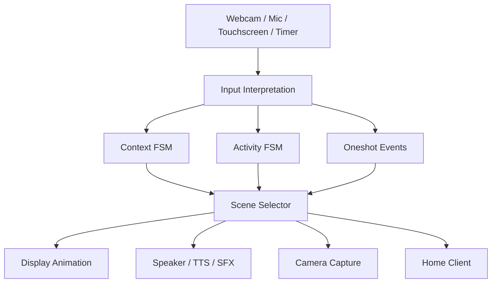
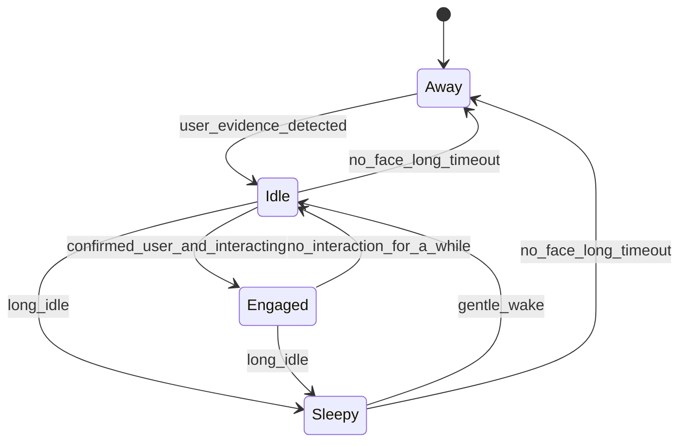
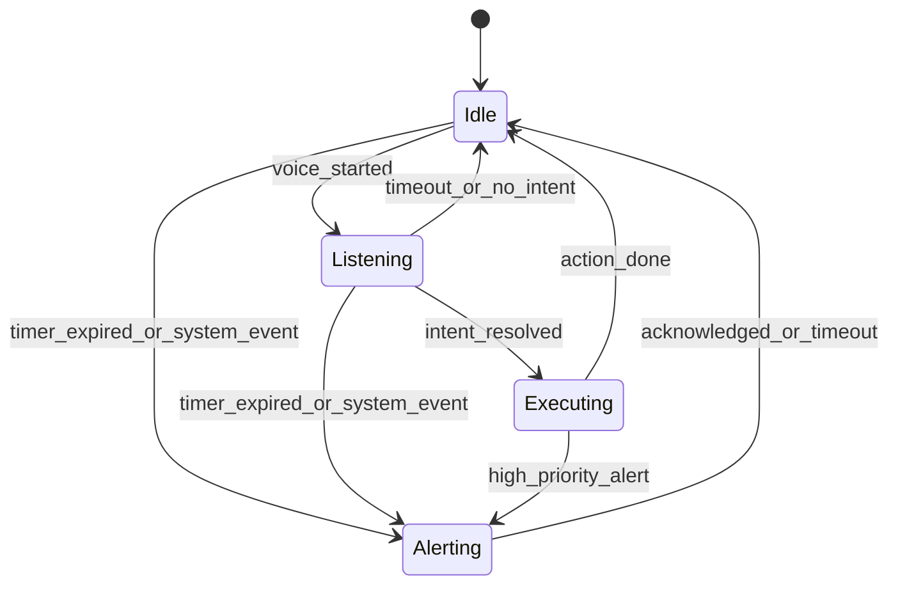

# State Machine

이 문서는 RIO가 실제로 "어떤 상태를 가지고 살아 움직이는지"를 설명하는 기준 문서입니다.
이전 4-FSM 구조(`Presence`/`Mood`/`Activity`/`UI`)를 단순화해, 현재 문서는 구현 기준을 `Context + Activity + Oneshot + Derived Output`으로 통일합니다.

핵심은 기능 실행보다 먼저 `상태를 가진 캐릭터`로 동작해야 한다는 점입니다.

RIO의 기본 동작은 아래 순서로 이해하는 것이 가장 자연스럽습니다.

`입력 감지 -> 의미 해석 -> 상태 변경 -> 씬 파생 -> 화면/사운드/기능 실행 -> 기본 상태 복귀`

## 1. 핵심 원칙

1. **상태 축은 2개만 둔다**: `Context`, `Activity`
2. **Mood(감정)와 UI(화면)는 상태가 아니다** → 2개 상태 + 이벤트로부터 **파생(derived)** 된다
3. **순간 반응은 상태가 아니라 oneshot 이벤트**로 처리 (자동 소멸)
4. 시선 이동은 상태가 아니라 애니메이션 규칙이며, 표정과 UI에도 동일한 철학("파생은 상태가 아니다")을 적용한다

중요한 점:

- `눈 방향 변화`는 별도 상태가 아닙니다. 웹캠 얼굴 중심 좌표를 입력으로 받아 `display adapter`가 애니메이션으로 표현합니다.
- 표정과 화면 레이아웃 역시 상태가 아니라 `Scene Selector`의 파생 출력입니다.

## 2. 전체 관계

핵심:

- FSM은 `Context`, `Activity` 두 개뿐
- 표정(Mood)과 화면 레이아웃(UI)은 `Scene Selector`가 두 상태 + 이벤트로부터 계산
- `startled`/`happy`/`welcome` 같은 **순간 감정**은 상태가 아닌 짧은 oneshot 이벤트

## 3. Context FSM

"지금 사용자/시간 맥락이 어떤가"를 관리합니다.
v1의 `Presence` + `Mood`의 장기 성분(`Calm`/`Sleepy`)을 합친 축입니다.

상태 의미:

- `Away`: 현재 사용자가 없음 (v1 `NoUser` + `LongAbsent` 통합)
- `Idle`: 최근 사용자 증거가 들어와 깨어 있는 상태지만, 아직 적극적 상호작용은 아님
- `Engaged`: 사용자가 보고/말하고/만지고 있는 집중 상호작용 상태 (v1 `Attentive`)
- `Sleepy`: 오래 상호작용이 없어 에너지가 낮은 상태

전이 조건 정의:

- `user_evidence_detected`
  - `face_detected`
  - 또는 `voice_started`
  - 또는 `touch.tap.detected` / `touch.stroke.detected`
- `confirmed_user_and_interacting`
  - `face_present == true`
  - 그리고 최근 상호작용 이벤트(voice/touch/gesture)가 존재

즉 `Idle`은 "확실히 누가 앞에 보인다"보다 넓은 개념입니다.
얼굴 없이 먼저 말이 들린 경우에도 `Away -> Idle`로 진입할 수 있습니다.

### 3.1 보조 런타임 사실

아래 값들은 **FSM 상태는 아니지만**, 현재 상태를 해석하고 파생 출력을 계산하는 데 반드시 필요합니다.

- `face_present: bool`
- `last_face_seen_at`
- `last_user_evidence_at`
- `last_interaction_at`
- `away_started_at`
- `active_executing_kind`
- `deferred_intent`

이 값들로 구현되는 대표적인 **파생 상황**은 아래와 같습니다.

- `is_searching_for_user`
  - `Activity == Listening`
  - 그리고 `face_present == false`

- `recent_face_loss`
  - `face_present == false`
  - 그리고 `now - last_face_seen_at < face_lost_timeout_ms`

- `just_reappeared`
  - 직전 Context가 `Away` 또는 `Sleepy`
  - 현재 Context가 `Idle`
  - 그리고 `now - away_started_at >= welcome_min_away_ms`

따라서 v1의 `Searching`, `FaceLost`, `Reappeared`는 더 이상 독립 상태가 아니라
`Context + Activity + runtime facts`로 계산되는 파생 상황입니다.

## 4. Activity FSM

"지금 무엇을 하고 있는가"를 관리합니다. v1 Activity FSM을 거의 유지하되, UI FSM과의 1:1 쌍을 제거합니다.

상태 의미:

- `Idle`: 특별한 작업 없음
- `Listening`: 음성 수신/해석 중
- `Executing(kind)`: 기능 실행 중. `kind`는 파라미터 (`weather`, `photo`, `smarthome`, `timer_setup`, `game`, `dance`)
- `Alerting`: 시스템이 사용자에게 적극적으로 피드백하는 중 (타이머 완료 등)

**변경점**: v1의 `WeatherAnswer`, `PhotoMode`, `SmartHomeControl`, `TimerSetup`, `GameMode`, `DanceMode`는 모두 `Executing(kind)` 한 상태로 통합하고 `kind` 파라미터로 구분합니다.
→ 상태 수는 줄지만 표현력은 동일하고, 씬 매핑 테이블만 확장하면 새 기능 추가가 쉽습니다.

### 4.1 Activity 인터럽트 정책

구현 단계에서 가장 많이 꼬이는 부분이므로 이 정책을 기본값으로 둡니다.

1. `Alerting`은 `Idle`, `Listening`, `Executing`을 모두 선점할 수 있습니다.
2. `Alerting -> Idle`로 복귀한 뒤, 중단된 작업을 자동 복원하지 않습니다.
   작업 재시도/재개는 도메인 로직이 별도로 결정합니다.
3. `Executing(photo)` 중에는 새 intent를 무시합니다. 예외는 `cancel`, `ack` 계열만 허용합니다.
4. `Executing(smarthome|weather|timer_setup)` 중에는 최신 `deferred_intent` 1개만 저장합니다.
   기존 보류 intent가 있으면 새 것으로 덮어씁니다.
5. `Executing -> Idle` 직후 `deferred_intent`가 있으면 즉시 `Idle -> Executing(kind)` 또는 `Idle -> Listening`으로 재진입합니다.
   어느 경로로 재진입할지는 intent가 이미 확정됐는지 여부에 따라 결정합니다.
6. `GameMode`, `dance`는 장시간 연출일 수 있으므로 기본적으로 신규 intent를 무시하고,
   `exit`, `cancel`, `high_priority_alert`만 받습니다.

## 5. Oneshot Events (상태 아님)

짧은 순간 반응은 상태가 아니라 이벤트로 처리합니다. 트리거되면 정해진 시간(보통 300ms ~ 2s) 동안 표정/사운드에 오버레이된 뒤 자동 소멸합니다.

| Event | priority | 트리거 | 지속 |
|---|---|---|---|
| `startled` | 30 | 얼굴 없이 큰 소리, 급격한 재등장 | ~600ms |
| `confused` | 25 | intent 해석 실패 | ~800ms |
| `welcome` | 20 | `just_reappeared == true` | ~1.5s |
| `happy` | 20 | 쓰다듬기, 성공 피드백 | ~1s |

**핵심**: 이벤트는 FSM 상태를 변경하지 않습니다. 진행 중인 상태 위에 잠깐 덧씌워질 뿐입니다. 따라서 "언제 빠져나오지?" 문제가 구조적으로 발생하지 않습니다.

즉:

- `Startled`, `Happy`는 oneshot으로 이동
- `Searching`, `FaceLost`, `Reappeared`는 파생 상황으로 이동

### 5.1 중첩 정책

동시에 여러 oneshot이 발생할 수 있으므로 아래 규칙으로 해소합니다.

1. **Priority preempt**: 진행 중인 oneshot보다 새 oneshot의 priority가 **더 높으면** 즉시 교체합니다. 남은 지속시간은 버립니다.
2. **Same priority coalesce**: priority가 같으면 **새 이벤트를 무시**합니다 (깜빡임 방지). 단, 진행 중 이벤트가 지속시간의 80% 이상 경과했다면 교체합니다.
3. **Lower priority drop**: 진행 중인 oneshot보다 낮은 priority는 항상 무시합니다.
4. **Queue 금지**: oneshot은 큐잉하지 않습니다. 즉시성이 핵심이며, 시간이 지난 뒤 뒤늦게 표출되는 것은 의미가 퇴색합니다.

> priority 값과 지속시간은 설정 파일에서 조정 가능하도록 분리합니다. 위 표는 기본값입니다.

## 6. Scene Selector (파생 규칙)

표정과 UI는 `(Context, Activity, active oneshot)` 3요소의 **순수 함수**입니다.

### 6.1 표정 (Mood 파생)

우선순위 (위에서부터 먼저 평가):

1. `Activity == Alerting` → `alert` (Context 무관, §6.4 override)
2. Active oneshot이 있으면 → 그 이벤트의 표정 (`startled`, `happy`, `welcome`, `confused`)
3. `Activity == Executing(kind)` → `attentive` 고정 (§6.4 Executing focus lock)
4. `Activity == Listening` → `attentive`
5. 그 외 (`Activity == Idle`)에는 `Context`에 따라:
   - `Away` → 비활성 (눈 감김/어두움)
   - `Idle` → `calm`
   - `Engaged` → `attentive`
   - `Sleepy` → `sleepy`

### 6.2 UI 레이아웃 (UI 파생)

`(Activity, Context)` 완전 매핑 테이블입니다. 빈칸 없이 모든 조합을 정의합니다.

| Activity | Context=Away | Context=Idle | Context=Engaged | Context=Sleepy |
|---|---|---|---|---|
| `Idle` | `NormalFace`(dim) | `NormalFace` | `NormalFace` | `SleepUI` |
| `Listening` | `ListeningUI` | `ListeningUI` | `ListeningUI` | `ListeningUI` |
| `Executing(photo)` | `CameraUI` | `CameraUI` | `CameraUI` | `CameraUI` |
| `Executing(game)` | `GameUI` | `GameUI` | `GameUI` | `GameUI` |
| `Executing(weather)` | `NormalFace` | `NormalFace` | `NormalFace` | `NormalFace` |
| `Executing(smarthome)` | `NormalFace` | `NormalFace` | `NormalFace` | `NormalFace` |
| `Executing(timer_setup)` | `NormalFace` | `NormalFace` | `NormalFace` | `NormalFace` |
| `Executing(dance)` | `NormalFace` | `NormalFace` | `NormalFace` | `NormalFace` |
| `Alerting` | `AlertUI` | `AlertUI` | `AlertUI` | `AlertUI` |

규칙:

- `Listening`/`Executing`/`Alerting`은 Activity가 UI를 지배합니다. Context에 관계없이 같은 UI를 씁니다 (사용자가 프레임을 잠깐 벗어나도 촬영/알림 UI가 유지되어야 자연스러움).
- `Idle`일 때만 Context가 UI를 결정합니다.
- `Away` + `Idle`은 `NormalFace`를 어둡게(`dim`) 표시합니다. 완전히 꺼진 화면이 아니라 "대기 중"을 시각화.
- `is_searching_for_user == true`이면 `ListeningUI` 안에서 search indicator를 추가로 띄울 수 있습니다. 하지만 별도 UI 상태를 만들지는 않습니다.

### 6.3 시선/눈동자

상태가 아닌 애니메이션 규칙입니다. 웹캠 얼굴 중심 좌표 → display adapter가 계산 (좌표 규격은 [architecture.md §6.4](architecture.md#64-좌표-규격) 참고).

### 6.4 Override 규칙 (Activity가 Context를 앞지르는 경우)

아래 두 경우는 Context의 장기 성분이 표정/UI를 바꾸지 않도록 **고정**합니다.

1. **Alerting override**: `Activity == Alerting`이면 Context와 무관하게 표정은 `alert`, UI는 `AlertUI`. 타이머 알림은 `Away`/`Sleepy`에서도 반드시 사용자에게 인지되어야 합니다.
2. **Executing focus lock**: `Activity == Executing(kind)` 동안에는 표정이 `attentive`로 고정됩니다. 촬영 중 사용자가 잠깐 프레임을 벗어나(`Engaged → Idle`) 표정이 `attentive → calm`으로 흔들리는 것을 방지합니다. 단, 이 구간에 oneshot이 들어오면(예: `happy` on success) 정상적으로 오버레이됩니다 — §6.1의 우선순위 2가 3보다 앞서기 때문.

> 이 override 규칙은 §6.1 우선순위에 이미 반영되어 있습니다. 이 절은 그 의도를 명시적으로 서술한 것입니다.

## 7. 대표 상태 조합

| 시나리오 | Context | Activity | Oneshot | 표정 | UI |
|---|---|---|---|---|---|
| 평상시 대기 | Away | Idle | - | 비활성 | NormalFace(dim) |
| 사용자가 옴 | Idle | Idle | - | calm | NormalFace |
| 적극 상호작용 | Engaged | Idle | - | attentive | NormalFace |
| 얼굴 없이 말 걸림 | Idle | Listening | startled | 놀람(잠깐) → attentive | ListeningUI + search indicator |
| 사진 촬영 | Engaged | Executing(photo) | - | attentive | CameraUI |
| 오래 비움 | Sleepy | Idle | - | sleepy | SleepUI |
| 오래 비운 뒤 재등장 | Idle | Idle | welcome | 반김(잠깐) → calm | NormalFace |
| 스마트홈 성공 | Engaged | Executing(smarthome) | happy | 기쁨(잠깐) → attentive | NormalFace |
| 타이머 울림 (사용자 있음) | Engaged | Alerting | - | alert | AlertUI |
| 타이머 울림 (부재 중) | Away | Alerting | - | alert | AlertUI |

## 8. 대표 시나리오

### 8.1 얼굴 없이 먼저 음성이 들림

- Context: `Idle` 유지 (또는 `Away → Idle`)
- Activity: `Idle → Listening`
- Oneshot: `startled` 발화
- Derived fact: `is_searching_for_user = true`

→ 놀란 표정으로 잠깐 반응 후 듣기 모드.
v1의 `Searching + Startled` 조합을 `Idle/Listening + startled + is_searching_for_user`로 표현합니다.

### 8.2 "사진 찍어줘"

- Activity: `Idle → Listening → Executing(photo) → Idle`
- Context: `Engaged` 유지

→ UI는 테이블로 `NormalFace → ListeningUI → CameraUI → NormalFace`로 자동 결정. 촬영 중 Context가 흔들려도 Executing focus lock으로 표정 유지.

### 8.3 오래 아무도 없음

- Context: `Idle → Sleepy`
- Activity: `Idle` 유지

→ 표정/UI가 자동으로 `sleepy` + `SleepUI`.

### 8.4 다시 나타난 직후 말 걸기

- Context: `Sleepy → Idle`
- Activity: `Idle → Listening`
- Oneshot: `welcome` 발화

→ 깨어남 + 반김이 한 프레임 안에 자연스럽게.

### 8.5 스마트홈 명령 성공/실패

- Activity: `Listening → Executing(smarthome) → Idle`
- 성공 시 oneshot: `happy`
- 실패 시 oneshot: `confused`

### 8.6 Sleepy 중 타이머 울림

- Context: `Sleepy` 유지
- Activity: `Idle → Alerting`
- 표정: `sleepy → alert` (Alerting override로 즉시 전환)
- UI: `SleepUI → AlertUI`

→ 사용자가 ACK하면 `Alerting → Idle`로 복귀, 표정/UI는 다시 `sleepy` + `SleepUI`.

## 9. v1과의 비교

| 항목 | v1 (4-FSM) | v2 (현재) |
|---|---|---|
| FSM 개수 | 4개 (Presence/Mood/Activity/UI) | 2개 (Context/Activity) |
| 상태 총수 | 6+5+9+6 = **26** | 4+4 = **8** |
| 순간 반응 처리 | FSM 상태로 둠 (Startled/Happy/Reappeared) | Oneshot 이벤트 (자동 소멸) |
| 표정 결정 | Mood FSM 상태 = 표정 | `(Activity, Context, oneshot)` 파생 |
| UI 결정 | UI FSM 상태 = 레이아웃 | `(Activity, Context)` 테이블 파생 |
| 충돌 가능성 | Scene Selector 우선순위 필요 | 구조적으로 불가능 (파생 함수라 결정적) |
| 새 기능 추가 | Activity + UI 양쪽에 상태 추가 | `Executing(kind)`에 kind 추가 + 테이블 한 줄 |
| 표현력 | 높음 | 동일 (시나리오 8.x 모두 재현 가능) |

### 주요 변경 요약

1. **Presence + Mood 통합 → Context**
   - `NoUser`/`LongAbsent` → `Away`
   - `UserVisible` + `Calm` → `Idle`
   - `UserVisible` + `Attentive` → `Engaged`
   - `Sleepy` → `Sleepy` (유지)
   - `Searching`/`FaceLost`/`Reappeared`/`Startled`/`Happy` → oneshot 이벤트로 이동

2. **Activity 간소화**
   - 기능별 상태(`WeatherAnswer`, `PhotoMode` 등 6개) → `Executing(kind)` 하나로 통합
   - `TimerAlert` → `Alerting` (범용화)

3. **UI FSM 완전 제거** — Activity/Context에서 테이블로 파생
4. **Mood FSM 완전 제거** — 장기 감정은 Context에, 순간 감정은 oneshot에
5. **Searching/FaceLost/Reappeared 제거** — 상태가 아닌 파생 상황으로 이동

## 10. 구현 시 지켜야 할 규칙

1. `Context`와 `Activity`는 서로의 상태를 직접 참조하지 않는다 (독립 축).
2. 표정/UI는 반드시 Scene Selector의 파생 함수로만 결정한다. FSM 전이 로직 안에서 표정을 직접 지시하지 않는다.
3. 짧은 반응은 항상 oneshot 이벤트로 구현한다. 새 상태를 만들지 않는다.
4. `Searching`, `FaceLost`, `Reappeared` 같은 짧은 맥락은 독립 상태를 만들지 말고 runtime facts로 계산한다.
5. 새 기능은 `Executing(kind)`의 `kind`를 늘리고 §6.2 테이블에 한 줄을 추가하는 방식으로만 확장한다.
6. §6.4의 override 규칙은 Scene Selector 안에서만 구현한다. FSM 전이에 override 로직을 넣지 않는다.
7. 모든 전이와 oneshot 트리거는 timestamp와 함께 기록한다.
8. 시간 임계치, oneshot 지속시간/priority, 테이블 매핑은 설정 파일로 분리한다.

## 11. 관련 이벤트 토픽

Architecture 문서의 [토픽 레지스트리](architecture.md#63-topic-레지스트리)와 정합되도록 아래 토픽을 사용합니다.

- `context.state.changed` — Context FSM 전이 (payload: `from`, `to`)
- `activity.state.changed` — Activity FSM 전이 (payload: `from`, `to`, `kind?`)
- `oneshot.triggered` — oneshot 이벤트 발화 (payload: `name`, `duration_ms`, `priority`)
- `scene.derived` — Scene Selector 출력 변경 (payload: `mood`, `ui`)
