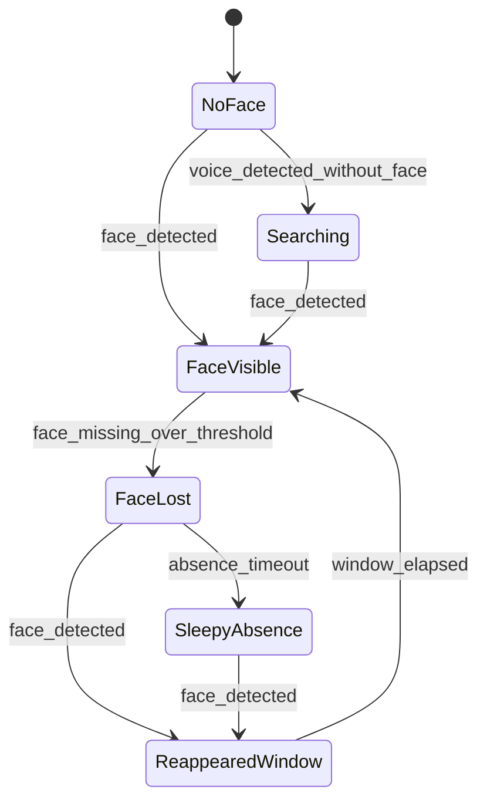
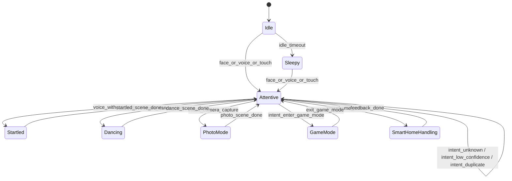
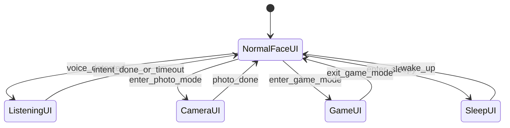
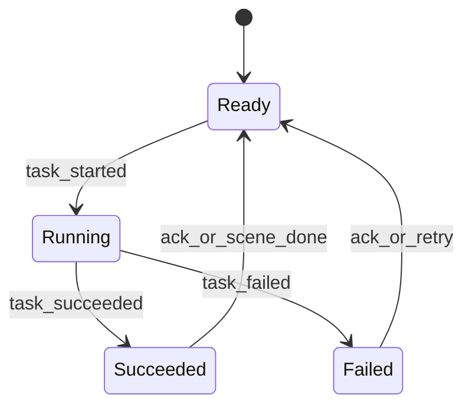

# State Machine

이 문서는 `prd.md`를 기준으로 RIO의 상태 전이를 실제 구현 가능한 형태로 정리한 문서입니다.
핵심 원칙은 `하나의 거대한 FSM 대신 여러 개의 작은 FSM`입니다.

## 1. 상태 머신 구성

RIO는 아래 4개의 FSM으로 나눕니다.

1. `Presence FSM`
2. `Behavior FSM`
3. `UI FSM`
4. `Task FSM`

이 네 가지를 동시에 보고 Main Orchestrator가 최종 액션을 결정합니다.

## 2. Presence FSM

Presence FSM은 `보임/사라짐/재등장`과 관련된 시간 맥락을 관리합니다.

상태 의미:

- `NoFace`: 화면 안에 얼굴이 없음
- `Searching`: 음성은 감지됐지만 아직 얼굴을 찾는 중
- `FaceVisible`: 얼굴이 안정적으로 검출됨
- `FaceLost`: 최근까지 보였으나 잠시 놓친 상태
- `SleepyAbsence`: 장시간 부재로 수면/졸음 연출 가능 상태
- `ReappearedWindow`: 재등장 직후 특별 반응을 줄 수 있는 짧은 시간창

## 3. Behavior FSM

Behavior FSM은 로봇이 지금 어떤 연출 단위로 움직이는지 관리합니다.

상태 의미:

- `Idle`: 기본 대기
- `Attentive`: 사용자에게 주의를 두고 있는 상태
- `Sleepy`: 장시간 유휴 후 수면/꿈 연출 상태
- `Startled`: 화들짝 놀람 반응
- `Dancing`: 댄스 씬
- `PhotoMode`: 사진 촬영 씬
- `GameMode`: 게임 UI 및 조작 활성 상태
- `SmartHomeHandling`: 스마트홈 명령 처리 및 피드백 상태

## 4. UI FSM

UI FSM은 얼굴/오버레이/HUD가 어떤 레이아웃으로 보이는지 관리합니다.

상태 의미:

- `NormalFaceUI`: 기본 얼굴 화면
- `ListeningUI`: STT/HUD를 강조하는 청취 상태
- `CameraUI`: 카운트다운과 플래시를 보여주는 촬영 상태
- `GameUI`: 얼굴 축소 및 게임 입력 UI 상태
- `SleepUI`: 졸음/꿈 애니메이션 상태

## 5. Task FSM

Task FSM은 시간이 걸리거나 외부 서비스가 필요한 작업을 관리합니다.

대상:

- 타이머
- 날씨 조회
- 스마트홈 명령
- 사진 저장

이 FSM을 따로 두는 이유:

- 외부 API 실패를 행동 상태와 분리 가능
- 스마트홈 실패 시에도 감정 연출은 정상 유지 가능
- 여러 작업이 동시에 돌더라도 추적 단위를 분리 가능

## 6. 대표 시나리오

### 6.1 얼굴 없이 음성 감지

- Presence: `NoFace -> Searching`
- Behavior: `Idle/Attentive -> Startled`
- UI: `NormalFaceUI -> ListeningUI`
- 이후 얼굴 검출 시:
  - Presence: `Searching -> FaceVisible`
  - Behavior: `Startled -> Attentive`

### 6.2 "사진 찍어줘"

- Behavior: `Attentive -> PhotoMode`
- UI: `NormalFaceUI -> CameraUI`
- Task: `Ready -> Running`
- 완료 후:
  - Task: `Running -> Succeeded`
  - Behavior: `PhotoMode -> Attentive`
  - UI: `CameraUI -> NormalFaceUI`

### 6.3 오래 방치됨

- Presence: `FaceLost -> SleepyAbsence`
- Behavior: `Idle -> Sleepy`
- UI: `NormalFaceUI -> SleepUI`

### 6.4 재등장 직후 말 걸기

- Presence: `SleepyAbsence -> ReappearedWindow`
- Behavior: `Sleepy -> Attentive`
- `voice_detected`가 window 안에 들어오면 추가 반김/깜짝 연출 실행

### 6.5 스마트홈 명령

- Intent: `smarthome.*`
- Behavior: `Attentive -> SmartHomeHandling`
- Task: `Ready -> Running`
- 성공 또는 실패 후:
  - Task: `Running -> Succeeded/Failed`
  - Behavior: `SmartHomeHandling -> Attentive`

### 6.6 Intent 실패 / 미인식 / 중복

Behavior FSM이 stuck되지 않도록 아래 경로를 항상 보장합니다.

- Low-confidence STT
  - 조건: `stt_confidence < voice.stt_confidence_min` ([thresholds.yaml](project-layout.md#thresholdsyaml))
  - 이벤트: `voice.intent.unknown` (intent 필드 없음)
  - Behavior: `Attentive` 유지, 짧은 `huh?` 반응 씬만 재생
  - UI: `ListeningUI -> NormalFaceUI` (타임아웃 경로 사용)

- Unknown intent (매칭 실패)
  - 조건: STT는 성공했으나 `triggers.yaml` 어느 alias와도 매칭 안 됨
  - 이벤트: `voice.intent.unknown` (`text` 필드 포함)
  - Behavior: `Attentive` 유지, `huh?` 또는 `sorry` 계열 반응
  - 연속 3회 발생 시 HUD에 `인식 못했어요` 안내 1회 표시

- Duplicate intent (쿨다운 중 재수신)
  - 조건: 동일 intent가 `behavior.intent_cooldown_ms` 이내 재수신
  - 현재 Behavior 상태가 해당 intent의 타깃 상태와 같으면 무시
  - 예: `Dancing` 상태에서 `dance.start` 재수신 → 무시, 선택적으로 가벼운 `acknowledge` 반응
  - 이벤트 발행 자체는 유지하되 Behavior 전이는 일으키지 않음

- 진행 중 Task가 있는데 다른 intent 수신
  - 규칙: `PhotoMode`, `SmartHomeHandling` 등 종료 조건이 있는 씬은 현재 Task 완료까지 신규 intent를 defer 큐에 쌓음
  - Task 종료 시 defer 큐의 최신 1건만 처리, 나머지는 drop
  - `ui.game_mode.enter` 같이 씬 전환이 필요한 intent는 defer 없이 즉시 취소+전환 허용

위 규칙은 모두 `Attentive -> Attentive` self-transition 범주로 취급하며, [architecture.md §6.3](architecture.md#63-topic-레지스트리)의 `voice.intent.unknown` topic과 연결됩니다.

## 7. 상태 저장소에 반드시 있어야 하는 값

- `face_present`
- `face_last_seen_at`
- `voice_last_detected_at`
- `reappeared_at`
- `current_behavior_state`
- `current_ui_state`
- `presence_state`
- `active_timers`
- `pending_tasks`
- `current_game`
- `last_intent`
- `last_intent_at`
- `deferred_intents`

## 8. 설계 규칙

1. 상태 머신은 전이만 담당하고 실제 사운드/UI 호출은 액션 플래너가 담당합니다.
2. 하나의 이벤트가 여러 FSM에 동시에 영향을 줄 수 있어야 합니다.
3. 모든 전이는 timestamp와 함께 기록합니다.
4. `n초`, `n분`, confidence 임계치, alias 문구는 설정 파일로 뺍니다. 기본값은 [project-layout.md §3 `thresholds.yaml`](project-layout.md#thresholdsyaml)을 기준으로 합니다.
5. Phase 2 기능이 아직 없더라도 상태 이름과 이벤트 계약은 지금 문서 기준을 따릅니다.
