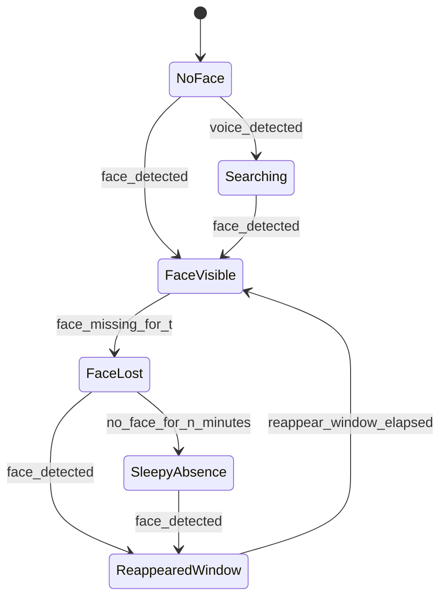
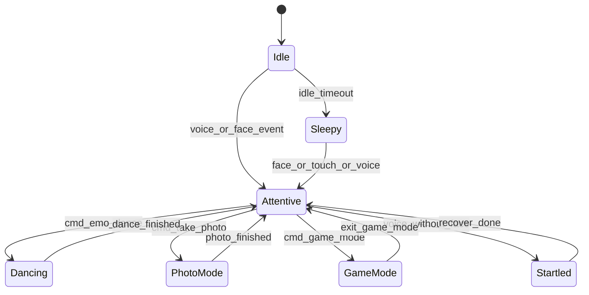
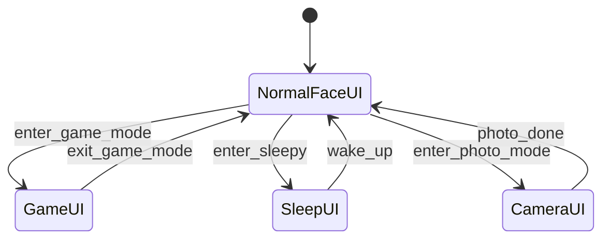
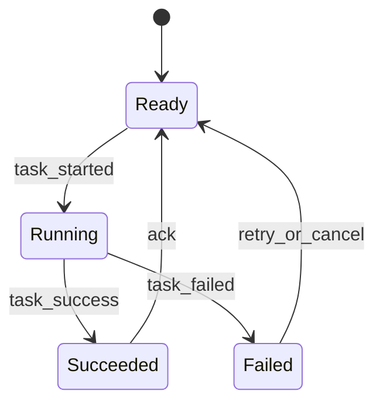

# State Machine Design

## 핵심 제안

이 프로젝트는 `하나의 FSM`보다 `여러 FSM의 조합`이 훨씬 적합합니다.

이유:

- 얼굴 존재 여부와 감정 상태는 다른 축입니다.
- 게임 모드와 졸음 상태도 다른 축입니다.
- 스마트홈 작업 진행 여부까지 합치면 상태 수가 너무 커집니다.

그래서 아래 4개 상태 머신을 추천합니다.

1. Presence FSM
2. Activity FSM
3. UI FSM
4. Task FSM

## 1. Presence FSM

사람이 보이는지, 사라졌는지, 방금 다시 나타났는지 관리합니다.

역할:

- `NoFace`: 아무도 보이지 않음
- `Searching`: 음성은 들렸지만 얼굴이 없어 찾는 중
- `FaceVisible`: 얼굴이 보임
- `FaceLost`: 방금 놓침
- `SleepyAbsence`: 오래 비어 있어 졸음 상태 유도
- `ReappearedWindow`: 재등장 직후의 특별 반응 시간을 관리

이 상태 머신이 중요한 이유:

- `재등장 직후 음성` 같은 시간 기반 반응을 깔끔하게 처리 가능

## 2. Activity FSM

로봇이 현재 무엇을 하고 있는지 관리합니다.

역할:

- `Idle`: 기본 대기 상태
- `Attentive`: 사용자를 인지하고 반응 중
- `Dancing`: 댄스 모드
- `PhotoMode`: 사진 촬영 관련 시퀀스
- `GameMode`: 게임 전용 인터랙션
- `Startled`: 놀람/화들짝 반응
- `Sleepy`: 유휴/졸음 상태

## 3. UI FSM

화면을 어떤 레이아웃으로 보여줄지 관리합니다.

여기서 분리하는 이유:

- 감정 상태와 화면 레이아웃을 섞지 않기 위해서
- `얼굴은 웃는 중`이면서 동시에 `게임 버튼 UI`가 떠 있을 수 있기 때문

## 4. Task FSM

외부 서비스나 시간이 걸리는 작업을 관리합니다.

예시 대상:

- 타이머
- 날씨 조회
- ThinQ 명령 전송
- 사진 저장

예시 흐름:

이 FSM을 따로 두는 이유:

- 네트워크 실패를 행동 상태와 분리 가능
- `"에어컨 켜줘"` 실패 시에도 로봇 표정/음성 반응은 유지 가능

## 5. 조합 예시

### 케이스 A: 얼굴 없이 "사진 찍어줘"

- Presence FSM: `NoFace -> Searching`
- Activity FSM: `Idle -> Startled`
- 이후 얼굴 검출되면:
  - Presence FSM: `Searching -> FaceVisible`
  - Activity FSM: `Startled -> PhotoMode`
  - UI FSM: `NormalFaceUI -> CameraUI`

### 케이스 B: 오래 방치됨

- Presence FSM: `FaceLost -> SleepyAbsence`
- Activity FSM: `Idle -> Sleepy`
- UI FSM: `NormalFaceUI -> SleepUI`

### 케이스 C: 재등장 후 바로 말 걸기

- Presence FSM: `SleepyAbsence -> ReappearedWindow`
- Activity FSM: `Sleepy -> Attentive`
- `voice_detected`가 window 안에 들어오면 추가 놀람/반김 리액션

## 6. 상태 저장소에 꼭 있어야 하는 값

- `face_present`
- `face_last_seen_at`
- `voice_last_detected_at`
- `reappeared_at`
- `current_activity`
- `current_ui_mode`
- `idle_started_at`
- `active_timers`
- `game_session`
- `pending_tasks`

## 7. 설계 팁

1. 상태 머신은 `전이 규칙`만 담당하게 두고, 실제 모터/오디오 실행은 액션 플래너로 넘기는 게 좋습니다.
2. 한 이벤트가 여러 FSM에 동시에 영향을 줄 수 있게 설계해야 합니다.
3. 모든 전이는 timestamp 기반으로 기록해야 디버깅이 쉬워집니다.
4. `n초`, `n분` 같은 값은 코드 상수로 박지 말고 설정 파일로 분리하는 편이 좋습니다.

