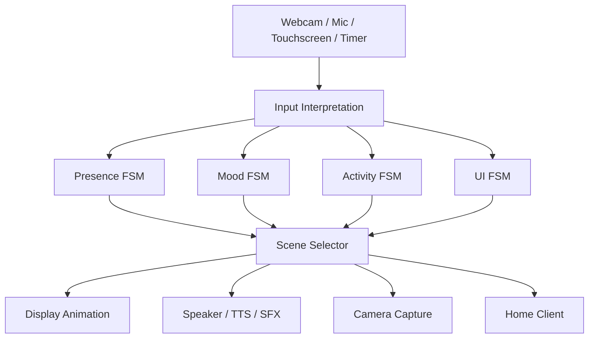
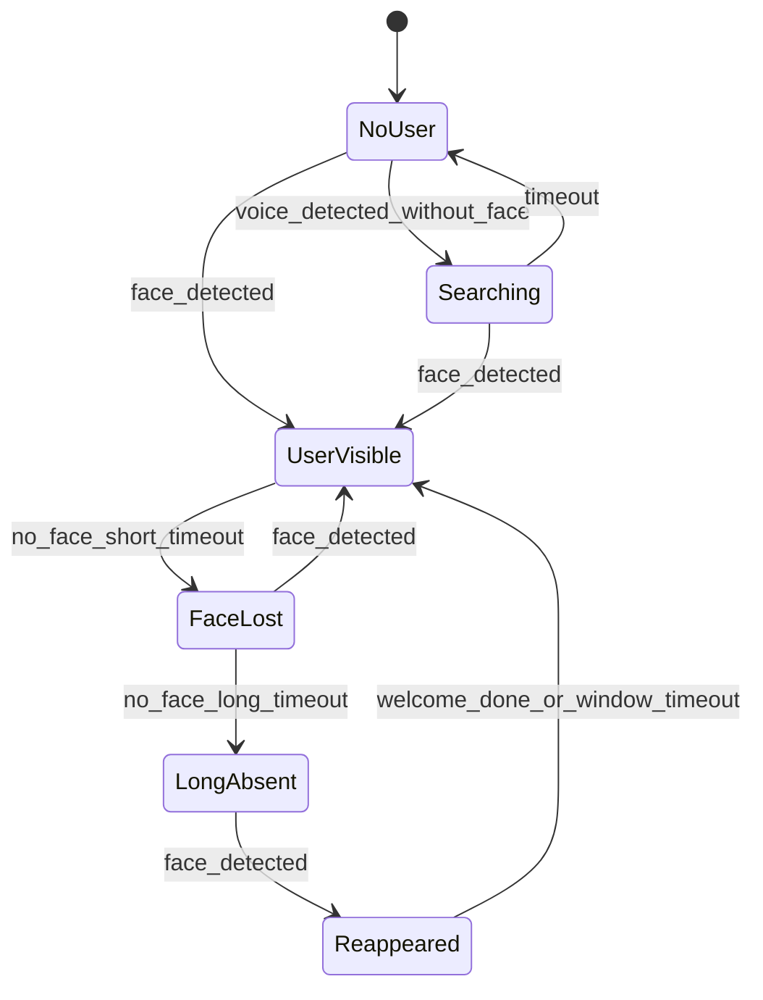
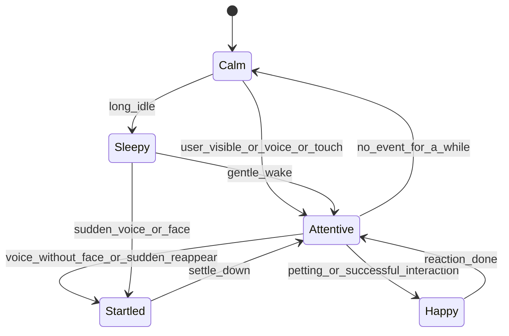
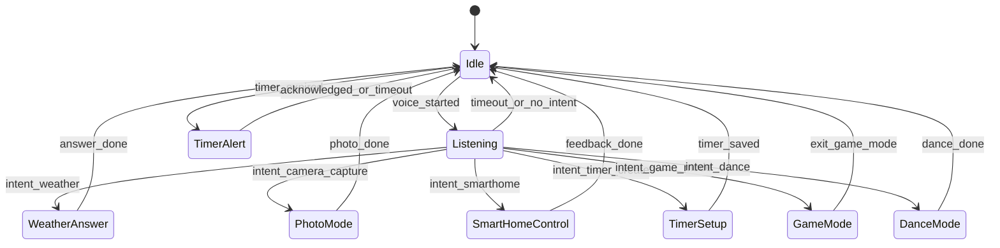
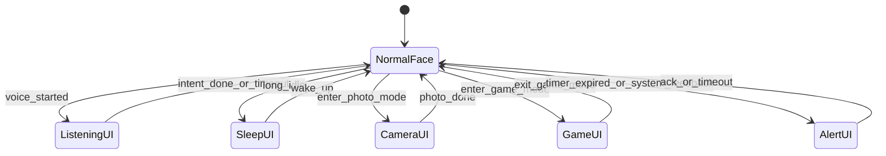

# State Machine

이 문서는 RIO가 실제로 "어떤 상태를 가지고 살아 움직이는지"를 설명하는 문서입니다.
핵심은 기능 실행보다 먼저 `상태를 가진 캐릭터`로 동작해야 한다는 점입니다.

RIO의 기본 동작은 아래 순서로 이해하는 것이 가장 자연스럽습니다.

`입력 감지 -> 의미 해석 -> 상태 변경 -> 씬 선택 -> 화면/사운드/기능 실행 -> 기본 상태 복귀`

## 1. 핵심 원칙

RIO는 하나의 거대한 상태 머신으로 만들지 않습니다.
대신 아래 4개의 축이 동시에 움직이는 구조로 봅니다.

1. `Presence FSM`
2. `Mood FSM`
3. `Activity FSM`
4. `UI FSM`

이 네 개를 동시에 보고 `scene selector`가 지금 어떤 반응을 보여줄지 결정합니다.

중요한 점:

- `눈 방향 변화`는 별도 상태가 아닙니다.
- 얼굴 중심 좌표를 입력으로 받아 `display adapter`가 애니메이션으로 표현합니다.

## 2. 전체 관계

## 3. Presence FSM

Presence FSM은 "사람이 있는가", "방금 사라졌는가", "다시 나타났는가"를 관리합니다.
이 축이 있어야 놀람, 반김, 졸음 같은 감정 반응이 자연스럽게 나옵니다.

상태 의미:

- `NoUser`: 현재 화면 앞에 사용자가 없음
- `Searching`: 음성은 들렸지만 얼굴이 아직 보이지 않음
- `UserVisible`: 사용자가 안정적으로 화면 안에 들어와 있음
- `FaceLost`: 방금까지 보였지만 잠깐 놓친 상태
- `LongAbsent`: 오래 비어 있어 수면/졸음 연출이 가능한 상태
- `Reappeared`: 오래 없다가 다시 나타난 직후의 특별 반응 구간

## 4. Mood FSM

Mood FSM은 "지금 어떤 감정 톤으로 반응하는가"를 관리합니다.
같은 기능을 수행하더라도 감정 톤이 다르면 캐릭터로 느껴지는 방식이 크게 달라집니다.

상태 의미:

- `Calm`: 평상시 기본 감정 상태
- `Attentive`: 사용자를 보고 듣고 있으며 집중하고 있는 상태
- `Sleepy`: 오래 상호작용이 없어 에너지가 낮아진 상태
- `Startled`: 갑작스러운 입력에 놀란 상태
- `Happy`: 쓰다듬기, 반김, 성공 피드백처럼 긍정적인 반응 상태

## 5. Activity FSM

Activity FSM은 "지금 무엇을 하고 있는가"를 관리합니다.
이 축은 기능 실행 흐름과 가장 가까운 상태 머신입니다.

상태 의미:

- `Idle`: 특별한 작업이 없는 기본 상태
- `Listening`: 음성을 듣고 해석하는 중
- `WeatherAnswer`: 날씨 응답 중
- `PhotoMode`: 사진 촬영 시퀀스 실행 중
- `SmartHomeControl`: 스마트홈 명령 처리 중
- `TimerSetup`: 타이머 등록 중
- `GameMode`: 게임 상호작용 중
- `DanceMode`: 댄스 시퀀스 실행 중
- `TimerAlert`: 타이머 완료를 알려주는 중

## 6. UI FSM

UI FSM은 현재 어떤 화면 레이아웃이 보여야 하는지를 결정합니다.
감정 상태와는 별개로, 지금 화면이 기본 얼굴인지 듣기 모드인지 게임 모드인지를 따로 관리해야 합니다.

상태 의미:

- `NormalFace`: 기본 얼굴 UI
- `ListeningUI`: STT/HUD 중심의 듣기 상태
- `SleepUI`: 졸음, 꿈, 수면 연출 상태
- `CameraUI`: 카운트다운, 플래시를 보여주는 촬영 상태
- `GameUI`: 얼굴 축소 + 게임 버튼/입력 UI 상태
- `AlertUI`: 타이머 완료나 시스템 피드백을 강조하는 상태

## 7. 눈동자와 시선 애니메이션

이 부분은 상태 머신의 상태가 아니라 `출력 규칙`입니다.

즉:

- `Presence = UserVisible`
- `Mood = Attentive`
- `webcam face center = (x, y)`

이면 `display adapter`가 눈동자 위치와 얼굴 방향감을 애니메이션으로 계산합니다.

정리하면:

- 시선 이동은 `state`가 아니라 `animation rule`
- 입력은 웹캠 얼굴 중심 좌표
- 출력은 Layer 1 Core Face의 눈동자/얼굴 방향 애니메이션

## 8. 대표 상태 조합

실제 런타임에서는 하나의 상태만 존재하는 게 아니라 네 축이 같이 조합됩니다.

예시:

- 평상시 대기
  - `Presence=NoUser`
  - `Mood=Calm`
  - `Activity=Idle`
  - `UI=NormalFace`

- 사용자가 화면 앞에 있음
  - `Presence=UserVisible`
  - `Mood=Attentive`
  - `Activity=Idle`
  - `UI=NormalFace`

- 얼굴 없이 말 걸었을 때
  - `Presence=Searching`
  - `Mood=Startled`
  - `Activity=Listening`
  - `UI=ListeningUI`

- 사진 촬영 중
  - `Presence=UserVisible`
  - `Mood=Attentive`
  - `Activity=PhotoMode`
  - `UI=CameraUI`

- 오래 비워둔 뒤 수면 상태
  - `Presence=LongAbsent`
  - `Mood=Sleepy`
  - `Activity=Idle`
  - `UI=SleepUI`

- 스마트홈 명령 처리 중
  - `Presence=UserVisible`
  - `Mood=Attentive`
  - `Activity=SmartHomeControl`
  - `UI=AlertUI` 또는 `NormalFace`

## 9. 대표 시나리오

### 9.1 얼굴 없이 먼저 음성이 들림

- Presence: `NoUser -> Searching`
- Mood: `Calm -> Startled`
- Activity: `Idle -> Listening`
- UI: `NormalFace -> ListeningUI`

이후 얼굴이 검출되면:

- Presence: `Searching -> UserVisible`
- Mood: `Startled -> Attentive`

즉, RIO는 바로 기능을 실행하는 것이 아니라 먼저 "놀라고 찾는" 반응을 보여줍니다.

### 9.2 "사진 찍어줘"

- Activity: `Idle -> Listening -> PhotoMode`
- UI: `NormalFace -> ListeningUI -> CameraUI`
- Mood: `Attentive` 유지

사진 완료 후:

- Activity: `PhotoMode -> Idle`
- UI: `CameraUI -> NormalFace`

### 9.3 오래 아무도 없음

- Presence: `FaceLost -> LongAbsent`
- Mood: `Calm -> Sleepy`
- UI: `NormalFace -> SleepUI`

이때는 단순 정지가 아니라 blink가 느려지고 꿈/졸음 연출이 들어가야 합니다.

### 9.4 다시 나타난 직후 바로 말 걸기

- Presence: `LongAbsent -> Reappeared -> UserVisible`
- Mood: `Sleepy -> Startled -> Attentive`
- Activity: `Idle -> Listening`

이 구간은 일반 응답보다 "깨어남 + 반김 + 집중"이 섞인 특별한 반응으로 처리하는 것이 좋습니다.

### 9.5 스마트홈 명령

- Activity: `Listening -> SmartHomeControl`
- Mood: `Attentive`
- UI: `ListeningUI -> AlertUI` 또는 `NormalFace`

성공 시:

- Mood: `Attentive -> Happy -> Attentive`

실패 시:

- Mood: `Attentive` 유지 또는 짧은 `Startled/미안함` 계열 반응

핵심은 성공/실패 모두 캐릭터 반응이 먼저 느껴져야 한다는 점입니다.

## 10. 구현 시 꼭 지켜야 할 규칙

1. 상태 전이와 화면 애니메이션을 분리합니다.
2. 기능 실행보다 먼저 `캐릭터 반응`이 보이게 설계합니다.
3. 하나의 입력이 여러 FSM에 동시에 영향을 줄 수 있어야 합니다.
4. 모든 전이는 timestamp와 함께 기록해야 합니다.
5. 시간 임계치, alias 문장, 반응 강도는 설정 파일로 분리합니다.
6. 상태가 애매하면 기능 중심보다 `존재감과 자연스러운 전이`를 우선합니다.
